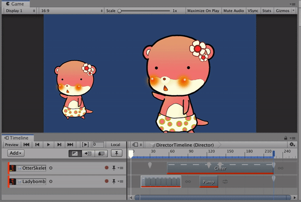
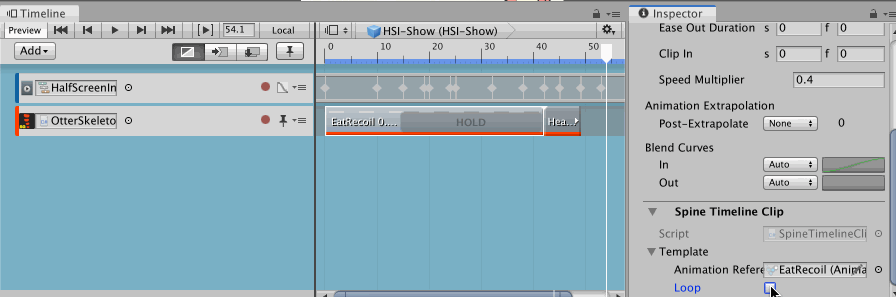
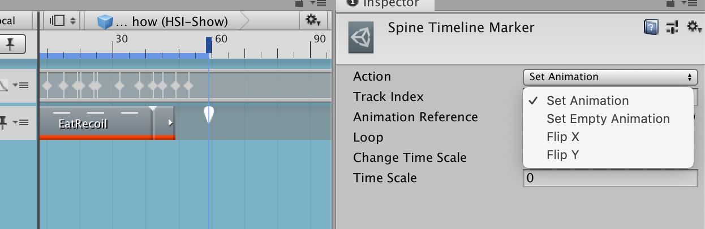
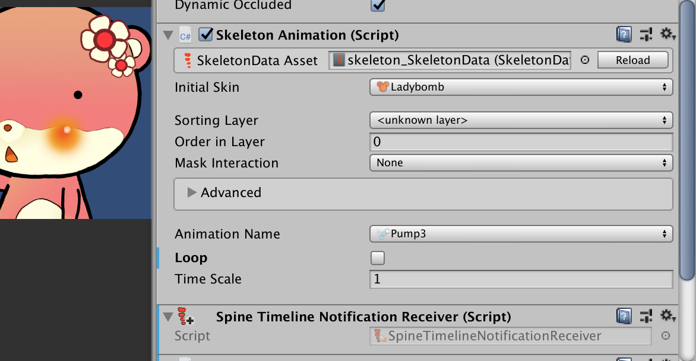

# Spine Timeline

- Minimum version is 2019.1 with .NET 4.6. Backward compatibility is not maintained since I want to go all out with things such as `UIElements`, C# 6 syntax, timeline markers, and playables notification API.
- Official Timeline integration from Spine [is coming](https://github.com/pharan/spine-unity-experimental/tree/spine-timeline/Assets/spine-unity-experimental/Spine%20Timeline/Documentation) and it seems to have strong backward compatibility like the rest of Spine Unity code. I need to animate my `SkeletonGraphic` now so I made this for use for the time being.
- Because Unity serialize class signature along the `ScriptableObject` system which supports the `PlayableAsset`, that in turn supports the entire timeline ecosystem, it is unlikely that you could migrate anything here to the official Spine Timeline tracks and clips. It will be a completely different container. So, keep that in mind if you want to use this early then move on later.
- [Discord channel is available too!](https://discord.gg/pX9eVmM) If you want to ask some questions in order to start contributing for example, I think this is the fastest way.

## `SkeletonAnimationTrack` + `SkeletonGraphicTrack`

Tracks that bind to respective type and both uses `SpineTimelineMixerBehaviour` for the process frame logic. Also both track accepts only `SpineTimelineClip`.

## `SpineTimelineClip`

- The clip is just a data storage and has no behaviour logic, all logic are on the track's mixer behaviour.
- Length of the actual animation is visible on clicking. It is from `Duration` info from your `AnimationReferenceAsset`.
- Checking `Loop` will change HOLD to loop indicator, allowing you to gauge how many loops it is going to occur.
- It is possible to use `SpeedMultiplier`. (Hold shift and drag the edge)
- It is possible to use `ClipIn`. Drag the left edge in to start the animation from any point while not affecting the looping part. This behaviour we want is exactly `TrackEntry.TrackTime`.
- It is possible to use all `Extrapolation` mode. For example to fill the clip's gap with the last frame of previous clip with `Hold` mode.
- Cross fading on the same track is still not supported but would be via `MixTime` and `MixDuration`. (There is a fragment of code in the behaviour script already but I don't have time to test it out) Also my game is not going to use it so the priority is not high, but contributions are welcome.

## `SpineTimelineMixerBehaviour`

A per-track behaviour which create a **new** `AnimationState` every evaluation and apply it onto the skeleton.  Not really the most efficient approach, but this make it possible to scrub the timeline and get any moment's Spine state at will. `AnimationState` that is on your `SkeletonAnimation` or `SkeletonGraphic` is not replaced, but temporarily suppressed. (read more below.)

Track layering is not planned at the moment since my game do not need it. You could contribute if you would like the feature. (I have prepared the `trackIndex` serialized into the track asset and accessible in the behaviour script already.)

On an empty area it will respect `Extrapolation` mode. So if you want the animation to freeze after it ended, use `Hold` for example. Disadvantage of this approach is that the timeline is always evaluating even when there is no clip on the playhead. This allows deterministic scrubbing so I think it is a good trade.

If no `Extrapolation` mode is on the empty area, the skeleton is repreatedly set to setup pose on every evaluation.

### Suppression behaviour

While the track is playing, it will try to suppress normal `Update()` of respective component.

- `SkeletonGraphic` get its `freeze` to `true` for the duration of the track.
- `SkeletonAnimation` get its `enabled` to `false` for the duration of the track. This make a yellow exclamation mark appear on the timeline which is annoying but it works.

The suppressed field will be restored to its previous state once the playable graph is destroyed. So if you have Wrap Mode as `Hold` or `Loop`, it will continue to be suppressed.

## `SpineTimelineMarker` + `SpineTimelineNotificationReceiver`

Uses the new Playable notification API in 2019.1 to trigger one-off action when playhead passed through a point. So it is not a sampled state, however the marker is `Retroactive` meaning that if you start the playback after the marker, its effect will be applied. For example evaluating any time after `FlipX` marker will give you a flipped animation without having to actually run through the marker. (So in a way it looks like a sampled state)

`SetAnimation` and `SetEmptyAnimation` is applied immediately, but its effect will not start until timeline finished playing because of the suppression behaviour mentioned earlier.

Markers with `INotification` affect track's total length, so if this marker is the final thing on the track it allows you to "send off" the skeleton by telling it to continue doing something after the track's playable had been destroyed. (`PlayableDirector` must be on `None` wrap mode and not `Hold` or `Loop`, or else the suppression behaviour will still continue.)

`FlipX`, and `FlipY` applies immediately and will not restore after the timeline ended.

Change time scale do not affect animation played from timeline's clip, it only affect component-updated animation. (For example, after the timeline is over the `SetAnimation` will use the time scale.)

The general rule of timeline marker/notification is that bound `GameObject`'s **all** components will receive an `INotification`, so attach `SpineTimelineNotificationReceiver` near either `SkeletonAnimation` or `SkeletonGraphic` for it to receive the marker and take action.

All markers currently cannot be preview in edit mode. It would be convenient if it could repeatedly set the skeleton's flip absolutely according to playhead position related to markers while in edit mode (with mixer behaviour code), then switch to trigger-based (with notification API code) in play mode. I have already migrated markers to the behaviour code but they currently has no use. Again, contributions are welcomed!

## Issues

See Issues section.